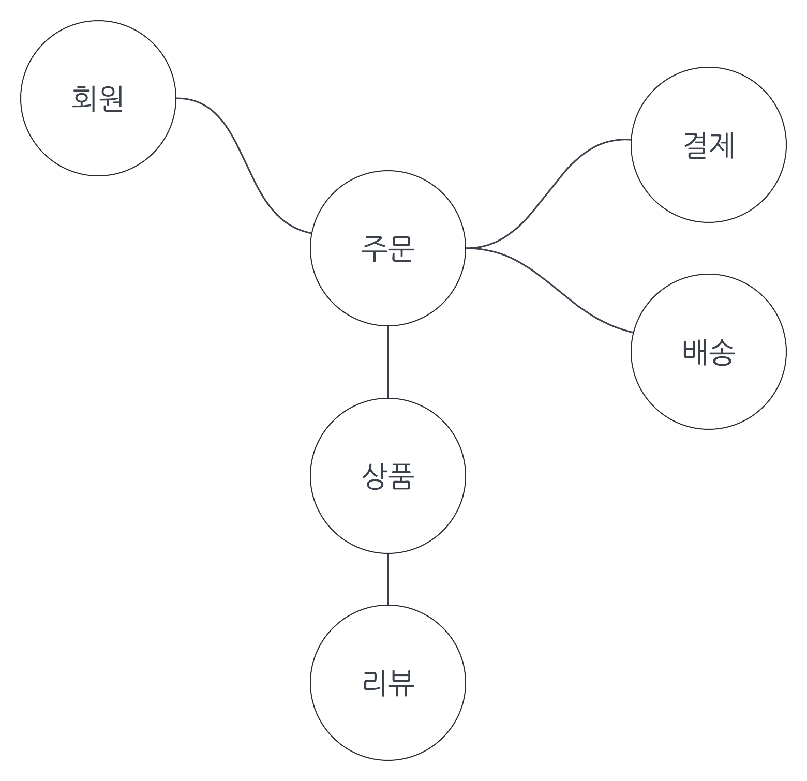
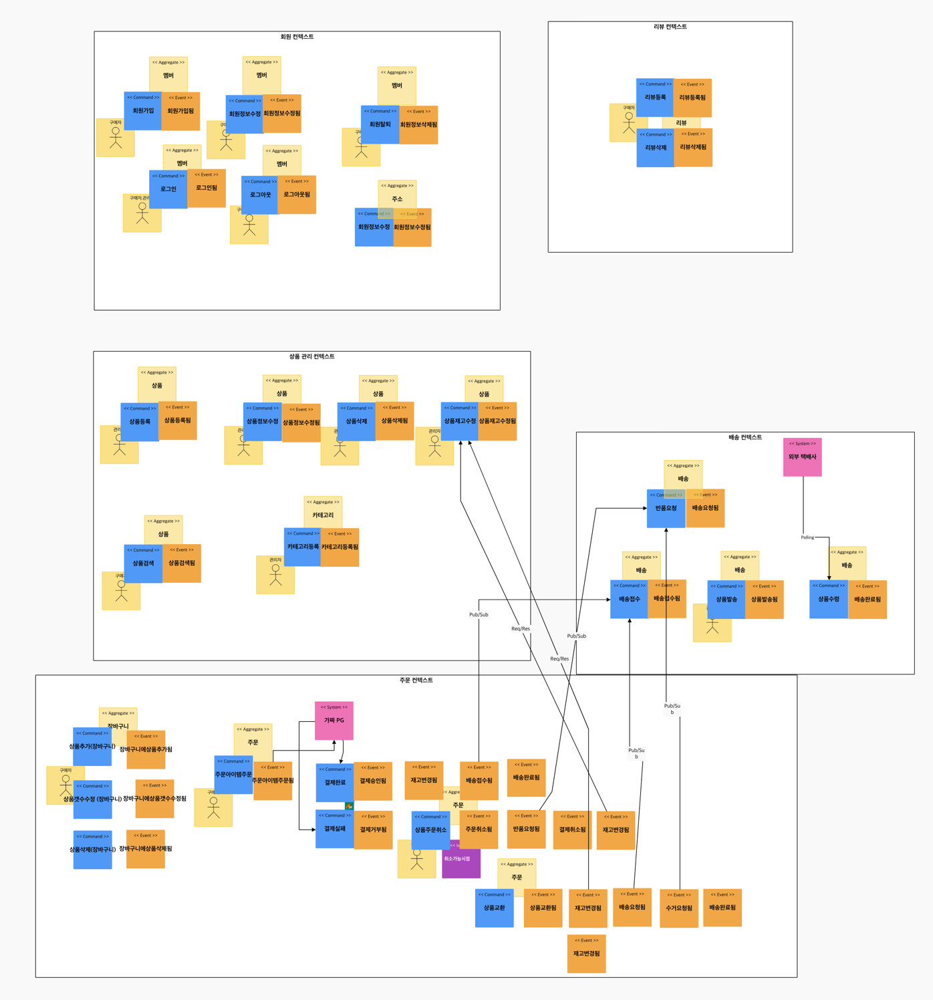
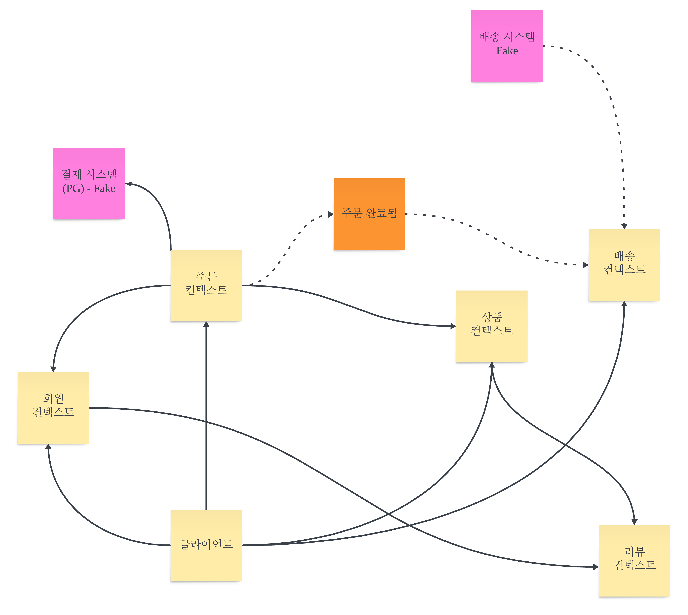

# 도메인 

- 친구 옷 쇼핑몰을 개편할려고 한다. 
- 기존 시스템은 수정하기가 어려운 환경이라서 직접 개발해서 수정할 예정

### 문제 영역 (= 도메인)

- 회원 
- 주문
- 결제
- 배송
- 상품 
- 리뷰

## 고민 
- 도메인은 문제 영역이라고 이해를 했다.
- ~~하위 도메인 패턴이 으로 분리하는게 어렵다~~
- 어떻게 보면 모든 부분이 주문이랑 엮이는데, (상품 제외)
  - ~~그런 경우에는 어떤식으로 접근해야할까?~~ 
  - ~~그냥 userId 라는 컬럼을 두고 외래키 없이 관리?~~

- 회원의 인증, 인가 부분은 API Gateway 에서 모두 처리하고 싶은데
- 그럼 gateway랑 회원 이 너무 결합되는것 같은데 괜찮을까?

### 해결 
- ~~하위 도메인 패턴이 으로 분리하는게 어렵다~~
  - 이벤트 스토밍을 통해서 분리

- 어떻게 보면 모든 부분이 주문이랑 엮이는데, (상품 제외)
  - ~~그런 경우에는 어떤식으로 접근해야할까?~~

  - 외래키 대신 id 로 처리 하게 설정 
  - 필요하다면 최대한 객체로 분리해서 약결합 되게 하자

## 이벤트 스토밍 

### v1

https://www.msaez.io/#/105191008/storming/havday

1. 도메인 이벤트 찾기 
2. 외부 시스템/외부 프로세스 찾기 
3. 커맨드 찾기
4. 핫스팟 찾기 
5. 액터 찾기 
6. 애그리거트 정의하기 
7. 바운디드 컨텍스트 정의하기 
8. 컨텍스트 매핑하기 

#### 컨텍스트 매핑

